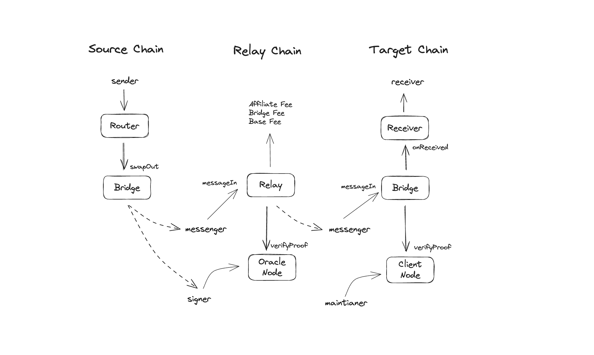

# ButterSwap Cross-Chain Flow

## Overview

Butter Network provides the infrastructure that allows transactions to move freely and securely across chains.

**Core Process**:
1. User initiates cross-chain request on source chain
2. Source chain Router → Bridge processing, lock/burn assets, and emit `MessageOut` event
3. MAP Relay Chain performs cross-chain verification and fee deduction, emit `MessageRelay` event
4. Target chain Bridge verifies and releases assets, emit `MessageIn` event
5. Receiver (optional) executes Swap or custom calls




### 1. Source Chain Processing

- Router contract serves as unified entry point
- Supports source chain Swap operations
- Bridge handles asset management and cross-chain message generation

### 2. MAP Relay Chain Verification

- **Oracle Verification**: Relay Chain uses multi-sig Oracle to verify blocks and receipts from other chains
- **Fee Processing**: Deduct Bridge Fee, Affiliate Fee, and Base Fee after verification
- **Message Relay**: Generate target chain proof and emit `MessageRelay` event
- **Cross-chain Coordination**: Coordinate verification between source and target chains

### 3. Target Chain Execution

- **Light Client Verification**: Verify MAP Relay Chain state using ZK + Light Client technology
- **Asset Management**: Mint/release BridgeToken based on verification results
- **Message Processing**: Emit `MessageIn` event after successful verification
- **Receiver Integration**: Optionally call Receiver contract for token swaps or custom interactions


## Core Contract Modules

### 1. Router Contract
Entry point for cross-chain transactions, supports swapping user tokens to BridgeToken on the source chain before initiating cross-chain requests.

### 2. Bridge Contract
Responsible for sending and verifying cross-chain transactions.
Locks/burns BridgeToken on the source chain and mints/releases BridgeToken on the target chain.

### 3. Relay Contract
Deployed on MAP Relay Chain, coordinates cross-chain verification and fee processing. Receives cross-chain requests from source chains, validates them through Oracle nodes, and generates proofs for target chains.

### 4. Receiver Contract
Handles Bridge Token exchange to target tokens on the target chain and supports custom contract interactions.

### 5. ClientNode Contract
Based on ZK + Light Client technology, used to verify MAP Relay Chain blocks and events to ensure cross-chain message validity.

### 6. OracleNode Contract
Based on multi-signature mechanism, used to verify blocks and events from other chains to ensure source chain transaction authenticity.

## Key Roles

### 1. User
End users who initiate cross-chain transactions and receive assets on the target chain.

### 2. Maintainer
Responsible for maintaining light client updates, periodically synchronizing MAP Relay Chain epoch information to other chains.

### 3. Messenger
Constructs cross-chain verification proofs and submits them to target chains for execution.

### 4. Oracle Signer
Submits cross-chain information from other chains to the oracle node for multi-signature verification.


## Fee Model

| Fee Type  | Purpose |
|---------|---------|
| Affiliate Fee | Reward for referrers who bring users |
| Bridge Fee | Cross-chain bridge service fee |
| Base Fee | Cover target chain gas execution costs |


### Exception Handling

- **Source Chain Failure**: Swap failure directly reverts, user assets are safe
- **Target Chain Failure**: Retry first, if retry fails then refund bridge token
- **Verification Failure**: No cross-chain operation executed, ensuring asset safety

## Typical Use Cases

### Scenario 1: Simple Cross-Chain Transfer
```
User → Router → Bridge → Relay Verification → Bridge → User
```

### Scenario 2: Cross-Chain Swap
```
User → Router(Swap) → Bridge → Relay Verification → Bridge → Receiver(Swap) → User
```

### Scenario 3: Cross-Chain DeFi Integration
```
User → Router → Bridge → Relay Verification → Bridge → Receiver(Custom Call) → DeFi Protocol
```

## Summary

Core advantages of ButterSwap cross-chain flow:

✅ **Three-Layer Architecture**: Source chain processing → MAP Relay Chain verification → Target chain execution

✅ **Hybrid Verification**: ZK + Light Client + Oracle triple security

✅ **Flexible Fee Model**: Unified fee processing on Relay Chain

✅ **High Extensibility**: Support for Receiver contract Swap and custom calls

✅ **Secure and Reliable**: Multi-layer verification mechanism and comprehensive exception handling
